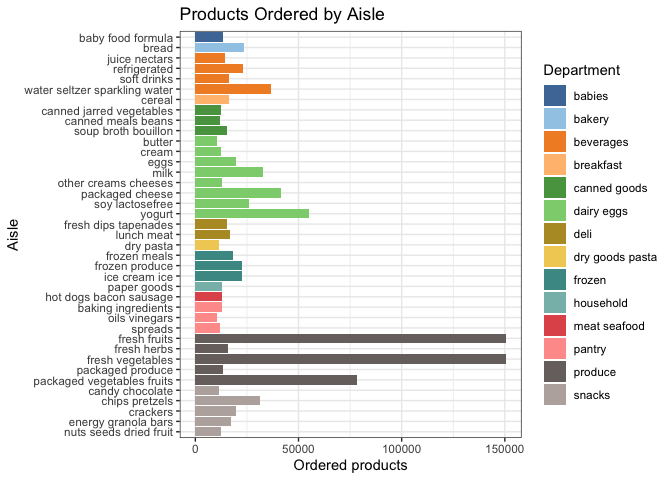

Homework 3
================
William Donovan

``` r
# Loading packages
library(tidyverse)
library(viridis)
```

# Problem 1

``` r
# Loading in Instacart dataset
library(p8105.datasets)
data("instacart")

# A quick look at the structure of the dataset
str(instacart)
```

    ## tibble [1,384,617 × 15] (S3: tbl_df/tbl/data.frame)
    ##  $ order_id              : int [1:1384617] 1 1 1 1 1 1 1 1 36 36 ...
    ##  $ product_id            : int [1:1384617] 49302 11109 10246 49683 43633 13176 47209 22035 39612 19660 ...
    ##  $ add_to_cart_order     : int [1:1384617] 1 2 3 4 5 6 7 8 1 2 ...
    ##  $ reordered             : int [1:1384617] 1 1 0 0 1 0 0 1 0 1 ...
    ##  $ user_id               : int [1:1384617] 112108 112108 112108 112108 112108 112108 112108 112108 79431 79431 ...
    ##  $ eval_set              : chr [1:1384617] "train" "train" "train" "train" ...
    ##  $ order_number          : int [1:1384617] 4 4 4 4 4 4 4 4 23 23 ...
    ##  $ order_dow             : int [1:1384617] 4 4 4 4 4 4 4 4 6 6 ...
    ##  $ order_hour_of_day     : int [1:1384617] 10 10 10 10 10 10 10 10 18 18 ...
    ##  $ days_since_prior_order: int [1:1384617] 9 9 9 9 9 9 9 9 30 30 ...
    ##  $ product_name          : chr [1:1384617] "Bulgarian Yogurt" "Organic 4% Milk Fat Whole Milk Cottage Cheese" "Organic Celery Hearts" "Cucumber Kirby" ...
    ##  $ aisle_id              : int [1:1384617] 120 108 83 83 95 24 24 21 2 115 ...
    ##  $ department_id         : int [1:1384617] 16 16 4 4 15 4 4 16 16 7 ...
    ##  $ aisle                 : chr [1:1384617] "yogurt" "other creams cheeses" "fresh vegetables" "fresh vegetables" ...
    ##  $ department            : chr [1:1384617] "dairy eggs" "dairy eggs" "produce" "produce" ...
    ##  - attr(*, "spec")=
    ##   .. cols(
    ##   ..   order_id = col_integer(),
    ##   ..   product_id = col_integer(),
    ##   ..   add_to_cart_order = col_integer(),
    ##   ..   reordered = col_integer(),
    ##   ..   user_id = col_integer(),
    ##   ..   eval_set = col_character(),
    ##   ..   order_number = col_integer(),
    ##   ..   order_dow = col_integer(),
    ##   ..   order_hour_of_day = col_integer(),
    ##   ..   days_since_prior_order = col_integer(),
    ##   ..   product_name = col_character(),
    ##   ..   aisle_id = col_integer(),
    ##   ..   department_id = col_integer(),
    ##   ..   aisle = col_character(),
    ##   ..   department = col_character()
    ##   .. )

The dataset includes 15 columns and 1384617 rows, containing information
about customer grocery orders placed through the Instacart app. Each row
represents a single product within an order and its associated details.
Key variables include `order_id`, `product_id`, `add_to_cart_order` (the
position of the item in the cart), `reordered` (binary indicator for
whether the customer had previously ordered the item), `user_id`, and
`eval_set` (always set to “train,” indicating this dataset is likely
used for model training). Additional variables describe ordering
behavior, such as `order_number` (sequence of the customer’s orders),
`order_dow` (day of the week, coded 0–6), `order_hour_of_day` (hour of
the day, coded 0–23), and `days_since_prior_order` (days since the
customer’s previous order). Product-level information includes
`product_name`, `aisle_id`, `department_id`, `aisle`, and `department`.

As a random example:

``` r
t(instacart[123,])
```

    ##                        [,1]                        
    ## order_id               "226"                       
    ## product_id             "39275"                     
    ## add_to_cart_order      "9"                         
    ## reordered              "0"                         
    ## user_id                "51011"                     
    ## eval_set               "train"                     
    ## order_number           "4"                         
    ## order_dow              "0"                         
    ## order_hour_of_day      "12"                        
    ## days_since_prior_order "30"                        
    ## product_name           "Organic Blueberries"       
    ## aisle_id               "123"                       
    ## department_id          "4"                         
    ## aisle                  "packaged vegetables fruits"
    ## department             "produce"

This example shows us that customer 51011 submitted an order (order ID
226) at about noon (hour 12) on the first day of the week (day 0). This
was the customer’s 4th order, and 30 days since they ordered previously.
The particular product ordered under this observation was organic
blueberries (product ID 39275). This was the 9th item added to the cart
and the first time the customer had ordered this item. Organic
blueberries are found in the “packaged vegetables fruits” aisle (aisle
ID 123) in the produce department (department ID 4).

A few insights we can pull from the data:

``` r
# Aisles and number of ordered items
instacart |>
  count(aisle, sort = TRUE)
```

    ## # A tibble: 134 × 2
    ##    aisle                              n
    ##    <chr>                          <int>
    ##  1 fresh vegetables              150609
    ##  2 fresh fruits                  150473
    ##  3 packaged vegetables fruits     78493
    ##  4 yogurt                         55240
    ##  5 packaged cheese                41699
    ##  6 water seltzer sparkling water  36617
    ##  7 milk                           32644
    ##  8 chips pretzels                 31269
    ##  9 soy lactosefree                26240
    ## 10 bread                          23635
    ## # ℹ 124 more rows

There are 134 aisles, and the top 3 aisles (in terms of ordered items)
are “fresh vegetables”, “fresh fruits”, and “packaged vegetables
fruits”.

Looking at aisles containing more than 10000 items ordered.

``` r
instacart |>
  group_by(aisle, department) |>
  summarise(ordered_items = n(), .groups = "drop") |>
  filter(ordered_items > 10000) |>
  mutate(aisle = fct_reorder(aisle, department)) |>
  ggplot(aes(y = aisle, x = ordered_items, fill = department)) +
  geom_col() +
  scale_fill_viridis(name = "department", discrete = TRUE) +
  scale_y_discrete(limits = rev) +
  theme_bw() +
  labs(
    title = "Products Ordered by Aisle",
    x = "Ordered products",
    y = "Aisle")
```

<!-- -->
